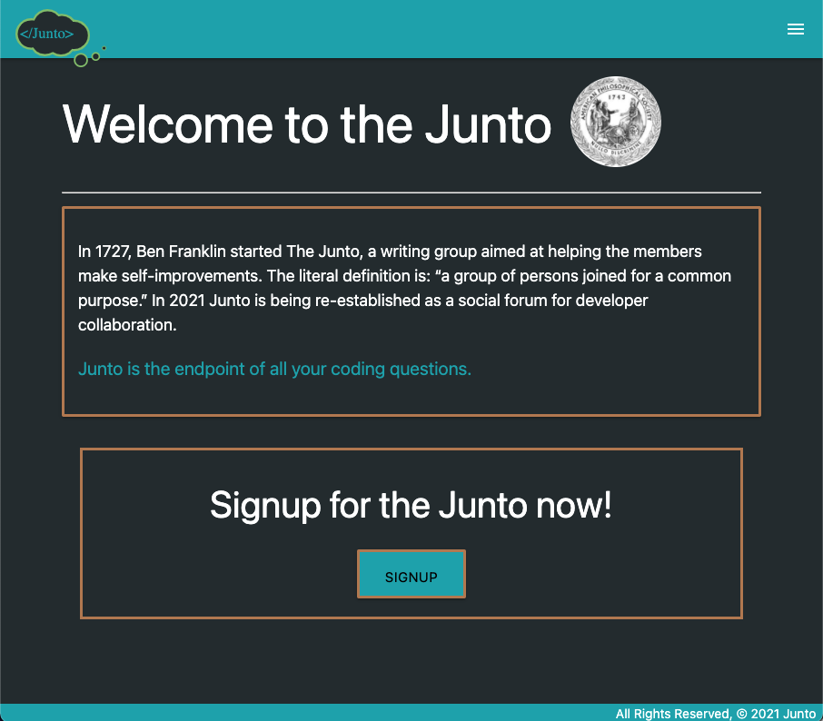
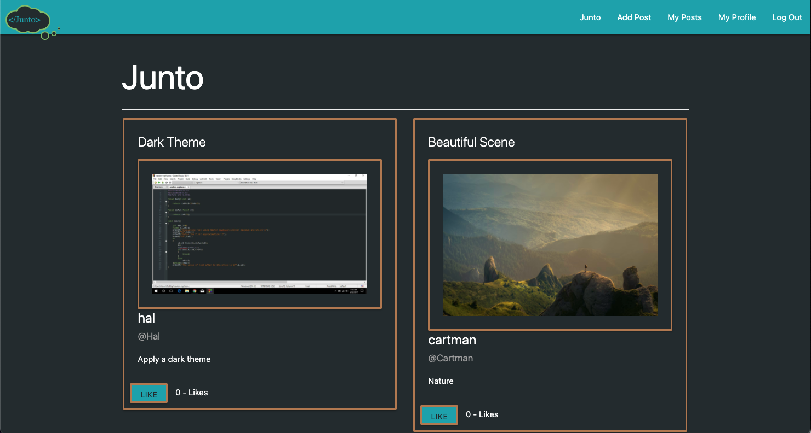
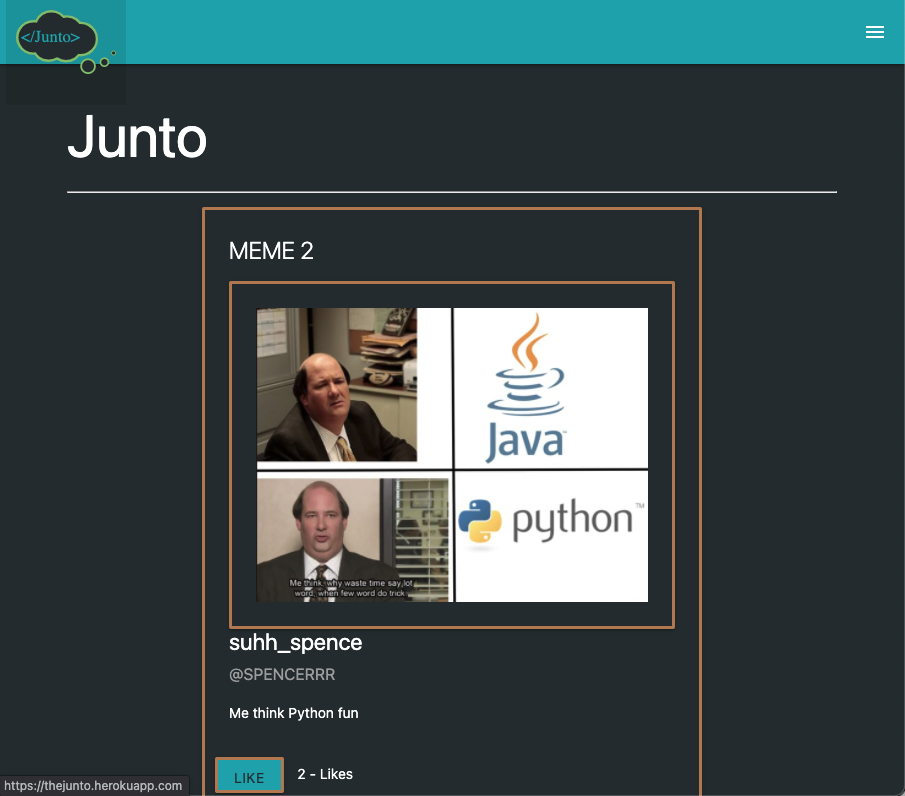
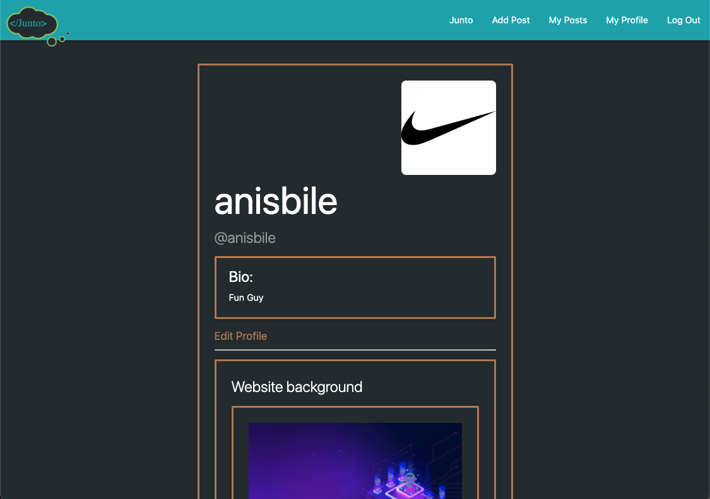
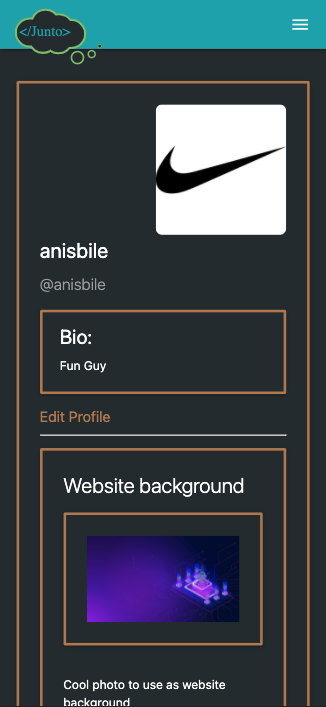

# **Junto** 

Google is great but sometimes googling just creates a mess. Where do you go when you need input, ideas, or support for your projects? Junto is the endpoint of all your coding questions. In 1727 Ben Franklin started The Junto, a writing group aimed at helping the members make self-improvements. The literal definition is- “a group of persons joined for a common purpose.” In 2021 Junto is being re-established as a social forum for developer collaboration. Junto is a collaborative space for developers to pin, tag, share, and find useful bits to add to their coding repertoire- including everything from simple CSS techniques, CDN tutorials, background images, to memes.

- CSS techniques
- Coding bits
- Memes
- Background Images
- Logos
- Icons
- And more

| Technologies Used |
|-------------------|
| Python            |
| Django            |
| JavaScript        |
| HTML              |
| CSS               |
| Disqus            |
| Materialize       |

## **Screenshots**

### Index Page

### Index Page

### Profile Page

### Mobile View

## **Deploy App**
Starting at the home page of our application you'll see the meaning behind Junto. You are then guided to sign up for Junto. That link will take you to a page where you can create an account and a profile with an avatar and bio. After you complete those steps you are a part of the Junto family where you have full access to the app. Enjoy! :)

[Click here launch](https://thejunto.herokuapp.com/)

## **Documentation**

[Trello Board](https://trello.com/b/rDvxAOUJ/junto/)

[Pitch Deck](https://docs.google.com/presentation/d/1Aawdz9yb2g9Fa2skT3bjJ85w1ceGtgJdpRgt9u0GG-0/edit#slide=id.p/)

## **Future Enchancements**
- Tags for posts 
- Search posts by tag
- Backgrounds picked by user
- Groups for users
- In-app code sandbox
- Have sandbox convertable to posts
- Uploadable/downloadable images/files

## **The Two and a Half Dads**

### Spencer Blanden

[LinkedIn](https://www.linkedin.com/in/spencer-blanden/)

[GitHub](https://github.com/spencerblanden)
- GitHub Manager
- Database Manager

### Lloyd Eddy
[LinkedIn](https://www.linkedin.com/in/lloyd-eddy-6136705/)

[GitHub](https://github.com/lloddy)
- Scrum Master
- Lead Designer

### Anis Bile
[LinkedIn](https://www.linkedin.com/in/anis-bile-baaa49216/)

[GitHub](https://github.com/Anisbile)
- Documenter
- Lead Dev

